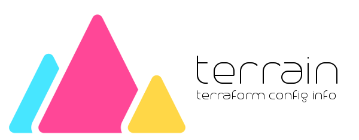

# Terrain
_Scans [Hashicorp Terraform](https://www.terraform.io/) files and lists the resources and datasources used in alphabetical order for documentation purposes._

## Installation
`todo`

## Usage
`todo`

## Features
- [ ] Parses all `.tf` files in the current directory
- [ ] flags to choose what to show (resources, or datasources)
- [ ] simple digraph or plantuml output
- [ ] markdown table output with links to docs

## References
- https://github.com/yutannihilation/go-parse-hcl-example/blob/master/main.go
- https://github.com/hashicorp/terraform/blob/d4ac68423c4998279f33404db46809d27a5c2362/config/loader_hcl2.go#L108-L121